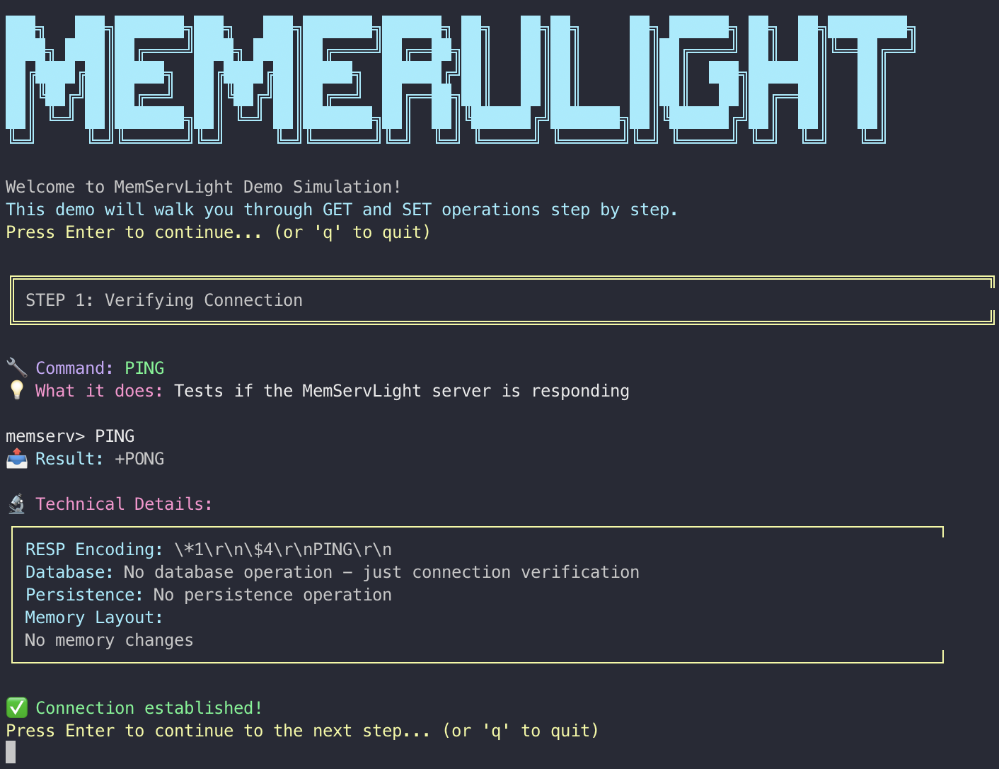

# MemServLight 🚀

A lightweight, high-performance caching server built with TypeScript and Node.js. This project draws inspiration from Redis concepts including RESP (Redis Serialization Protocol), efficient in-memory storage, and AOF (Append-Only File) persistence.

## ✨ Features

- **RESP Protocol Implementation**: Redis Serialization Protocol support for client-server communication
- **High-Performance Storage**: O(1) average time complexity for core operations using JavaScript's built-in Map
- **Redis Compatibility**: Works with existing Redis clients and tools
- **Persistence Layer**: AOF (Append-Only File) for data durability
- **TTL Support**: Key expiration with efficient cleanup mechanisms
- **Comprehensive Testing**: Unit tests covering all critical paths
- **Performance Benchmarks**: Detailed analysis vs Redis for production validation

## 🏗️ Architecture & Design Decisions

```
┌─────────────────────────────────────────────────────────┐
│                    Client Interface                     │
├─────────────────────────────────────────────────────────┤
│                  RESP Protocol Layer                    │
├─────────────────────────────────────────────────────────┤
│                   Command Parser                        │
├─────────────────────────────────────────────────────────┤
│                  Storage Engine                         │
│               ┌─────────────────┐                       │
│               │   JavaScript    │                       │
│               │   Map (Hash)    │                       │
│               │   (O(1) ops)    │                       │
│               └─────────────────┘                       │
├─────────────────────────────────────────────────────────┤
│                  Persistence Layer                      │
│  ┌─────────────────┐  ┌─────────────────┐               │
│  │   AOF Writer    │  │   Recovery      │               │
│  └─────────────────┘  └─────────────────┘               │
└─────────────────────────────────────────────────────────┘
```

### Storage Engine

The core storage engine uses JavaScript's built-in `Map` data structure, which provides:

- **O(1) Average Complexity**: Fast lookups, inserts, and deletes for core operations (SET, GET, DELETE, EXISTS)
- **Memory Efficiency**: Compact storage with minimal overhead
- **Built-in Optimization**: Leverages V8 engine's highly optimized hash table implementation
- **Collision Resolution**: Handled automatically by the JavaScript engine

**Note**: Some operations like `KEYS` with patterns and `CLEANUP` are O(n) as they require iteration through all entries.

### Protocol Design

I implemented the **RESP (Redis Serialization Protocol)** for several strategic reasons:

- **Industry Standard**: Widely adopted, well-documented protocol
- **Client Compatibility**: Works with existing Redis clients and tools. For example, for benchmarking I used [redis-benchmark](https://redis.io/docs/latest/operate/oss_and_stack/management/optimization/benchmarks/).
- **Performance**: Binary-safe, efficient serialization format

### Persistence Strategy

**AOF (Append-Only File)** persistence is implemented in the server (not the CLI) and was chosen over RDB for:

- **Durability**: Every write operation is logged, no data loss
- **Performance**: Sequential writes are fast and predictable
- **Simplicity**: Append-only design is crash-safe and easy to implement

Persistence is **disabled by default** for performance reasons. Large AOF files (>100MB) may require significant processing time during server startup. Enable persistence only when data durability is required.

## 🚀 Quick Start

### Installation

```bash
# Clone and setup
git clone git@github.com:flandrade/memserv-light.git
cd memserv-light
npm install
npm run build

# Start the caching service (persistence disabled by default)
npm start

# Enable persistence (optional - for data durability)
MEMSERV_PERSISTENCE=true npm start
```

The service runs on `localhost:6379` (Redis default port) for easy integration.

### Using the Service

```bash
# Interactive CLI (recommended)
npm run cli

# Example interactive session:
MemServLight CLI - Type "quit" to exit
memserv> SET user:1 "John Doe"
OK
memserv> GET user:1
"John Doe"
memserv> KEYS *
["user:1"]
memserv> quit

# Single command (creates new instance each time)
npm run cli -- -c "PING"
PONG
```

## 📚 Supported Operations

| Operation    | Command                      | Description                            | Complexity |
| ------------ | ---------------------------- | -------------------------------------- | ---------- |
| **Store**    | `SET key value [EX seconds]` | Store key-value pair with optional TTL | O(1) avg   |
| **Retrieve** | `GET key`                    | Get value by key                       | O(1) avg   |
| **Delete**   | `DEL key`                    | Remove key-value pair                  | O(1) avg   |
| **Exists**   | `EXISTS key`                 | Check if key exists                    | O(1) avg   |
| **List**     | `KEYS pattern`               | List keys matching pattern             | O(n)       |
| **TTL**      | `TTL key`                    | Get time to live                       | O(1) avg   |
| **Expire**   | `EXPIRE key seconds`         | Set expiration time                    | O(1) avg   |

### Advanced Usage

```bash
# Set with expiration (10 seconds)
SET session:abc "temp_data" EX 10

# Check remaining TTL
TTL session:abc

# Pattern matching
KEYS user:*
```

## 🎮 Interactive Demo

Experience the caching service in action:

```bash
npm run demo
```



The demo showcases:

- **12 Step-by-step Operations**: From basic operations to advanced TTL management
- **Visual Memory Layout**: See how data is stored and managed
- **RESP Protocol Deep Dive**: Understand the serialization format
- **Performance Insights**: Learn about the internal optimizations
- **Interactive Learning**: Control the pace and explore internals

## 📊 Performance Analysis

Performance is critical for any caching service. I've conducted comprehensive benchmarks against Redis:

### [📈 Detailed Performance Results](documentation/performance-analysis.md)

**Key Performance Characteristics:**

- **Throughput**: 140,845 SET ops/sec, 217,391 GET ops/sec at optimal concurrency
- **Latency**: P95 latency under 15ms at 800 concurrent clients
- **Memory Efficiency**: Leverages V8's optimized Map implementation

## Persistence Limitations

### Current Limitations

The AOF persistence system has some limitations that should be considered:

- **Large File Processing**: AOF files larger than 100MB may take significant time to process during server startup
- **Startup Time**: Server startup time increases proportionally with AOF file size

### Recommendations

- **Development/Testing**: Use persistence disabled for faster startup times
- **Production with Small Datasets**: Enable persistence for data durability
- **Production with Large Datasets**: Don't use persistence. Work in progress.

### Future Improvements

Planned enhancements for better large file handling:

- Incremental AOF processing
- Background restoration
- AOF file compression
- Checkpoint-based recovery

### Running Benchmarks

```bash
# Full performance benchmark with graphs
./scripts/benchmark-graph.sh

# Performance profiling
./scripts/benchmark-profile.sh
```

Results include CSV data, performance graphs, and detailed analysis for production validation.

## 🧪 Run Tests

```bash
# Run comprehensive test suite
npm test
```

## 📁 Project Structure

```
src/
├── memserv/          # Core caching engine
├── serializer/       # RESP protocol implementation
├── store/           # Storage engine and persistence
├── utils/           # Utility functions
├── cli.ts           # Command-line interface
└── server.ts        # TCP server implementation

scripts/
├── demo-simulation.ts    # Interactive demo
├── benchmark-graph.sh    # Performance benchmarking
└── benchmark-profile.sh  # Profiling tools

documentation/
├── performance-analysis.md  # Performance results
└── *.png                   # Performance graphs
```

## 📄 License

MIT License - feel free to use this code for learning and experimentation.
