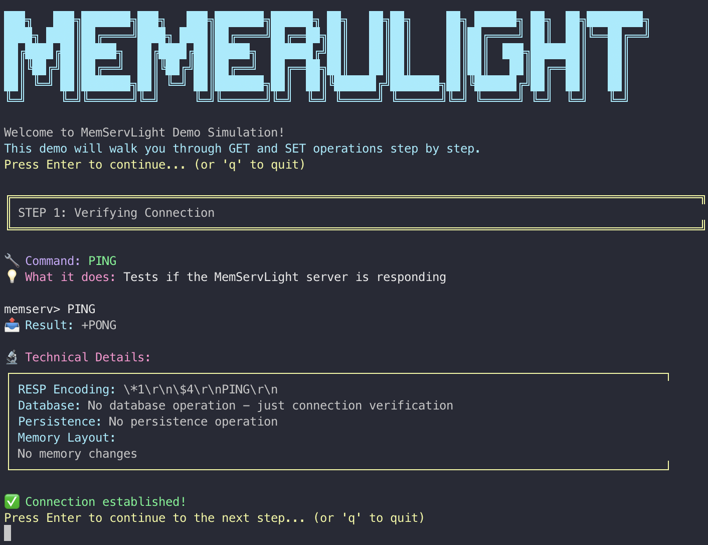

# MemServLight

A lightweight caching server built with TypeScript and Node.js. Inspired by Redis, it implements RESP (Redis Serialization Protocol), in-memory storage, and AOF persistence.

## Features

- RESP protocol implementation - works with existing Redis clients
- O(1) average time complexity for core operations using JavaScript's Map
- AOF (Append-Only File) persistence for data durability
- TTL support with key expiration
- Unit tests and performance benchmarks

## Architecture

```
┌─────────────────────────────────────────────────────────┐
│                    Client Interface                     │
├─────────────────────────────────────────────────────────┤
│                  RESP Protocol Layer                    │
├─────────────────────────────────────────────────────────┤
│                   Command Parser                        │
├─────────────────────────────────────────────────────────┤
│                  Storage Engine                         │
│               ┌─────────────────┐                       │
│               │   JavaScript    │                       │
│               │   Map (Hash)    │                       │
│               │   (O(1) ops)    │                       │
│               └─────────────────┘                       │
├─────────────────────────────────────────────────────────┤
│                  Persistence Layer                      │
│  ┌─────────────────┐  ┌─────────────────┐               │
│  │   AOF Writer    │  │   Recovery      │               │
│  └─────────────────┘  └─────────────────┘               │
└─────────────────────────────────────────────────────────┘
```

### Storage Engine

Uses JavaScript's built-in `Map` data structure:

- O(1) average complexity for SET, GET, DELETE, EXISTS
- Leverages V8's optimized hash table implementation
- Memory efficient with minimal overhead

Note: `KEYS` and `CLEANUP` operations are O(n) since they iterate through all entries.

### Protocol Design

I implemented RESP (Redis Serialization Protocol) because:

- It's a well-documented industry standard
- Works with existing Redis clients and tools (including [redis-benchmark](https://redis.io/docs/latest/operate/oss_and_stack/management/optimization/benchmarks/))
- Binary-safe and efficient

### Persistence Strategy

AOF (Append-Only File) persistence is implemented in the server. I chose it over RDB because:

- Every write operation is logged (no data loss)
- Sequential writes are fast and predictable
- Append-only design is crash-safe

Persistence is disabled by default for better performance. Large AOF files (>100MB) can take time to process during startup, so only enable it when you need data durability.

## Quick Start

### Installation

```bash
git clone git@github.com:flandrade/memserv-light.git
cd memserv-light
npm install
npm run build

# Start server (persistence disabled by default)
npm start

# Or with persistence enabled
MEMSERV_PERSISTENCE=true npm start
```

Server runs on `localhost:6379` (Redis default port).

### Usage

```bash
# Interactive CLI
npm run cli

# Example session:
MemServLight CLI - Type "quit" to exit
memserv> SET user:1 "John Doe"
OK
memserv> GET user:1
"John Doe"
memserv> KEYS *
["user:1"]
memserv> quit

# Single command
npm run cli -- -c "PING"
PONG
```

## Supported Operations

| Operation    | Command                      | Description                            | Complexity |
| ------------ | ---------------------------- | -------------------------------------- | ---------- |
| **Store**    | `SET key value [EX seconds]` | Store key-value pair with optional TTL | O(1) avg   |
| **Retrieve** | `GET key`                    | Get value by key                       | O(1) avg   |
| **Delete**   | `DEL key`                    | Remove key-value pair                  | O(1) avg   |
| **Exists**   | `EXISTS key`                 | Check if key exists                    | O(1) avg   |
| **List**     | `KEYS pattern`               | List keys matching pattern             | O(n)       |
| **TTL**      | `TTL key`                    | Get time to live                       | O(1) avg   |
| **Expire**   | `EXPIRE key seconds`         | Set expiration time                    | O(1) avg   |

### Advanced Usage

```bash
# Set with expiration (10 seconds)
SET session:abc "temp_data" EX 10

# Check remaining TTL
TTL session:abc

# Pattern matching
KEYS user:*
```

## Interactive Demo

```bash
npm run demo
```



The demo shows 12 operations demonstrating everything from basic commands to TTL management, including visualizations of the memory layout and RESP protocol format.

## Performance Analysis

I've benchmarked this against Redis. [Full results here](docs/performance-analysis.md).

Key metrics:

- Throughput: 140,845 SET ops/sec, 217,391 GET ops/sec
- Latency: P95 under 15ms at 800 concurrent clients
- Uses V8's optimized Map implementation

## Persistence Limitations

Current limitations:

- AOF files over 100MB take significant time to process on startup
- Startup time scales with file size

Recommendations:

- Development/testing: disable persistence for faster startup
- Production with small datasets: enable persistence
- Production with large datasets: don't use persistence (work in progress)

Future improvements planned: incremental processing, background restoration, compression, checkpoint-based recovery.

### Running Benchmarks

```bash
# Performance benchmark with graphs
./scripts/benchmark-graph.sh

# Performance profiling
./scripts/benchmark-profile.sh
```

## Tests

```bash
npm test
```

## Project Structure

```
src/
├── memserv/          # Core caching engine
├── serializer/       # RESP protocol implementation
├── store/           # Storage engine and persistence
├── utils/           # Utility functions
├── cli.ts           # Command-line interface
└── server.ts        # TCP server implementation

scripts/
├── demo-simulation.ts    # Interactive demo
├── benchmark-graph.sh    # Performance benchmarking
└── benchmark-profile.sh  # Profiling tools

docs/
├── performance-analysis.md  # Performance results
└── *.png                   # Performance graphs
```

## License

MIT
