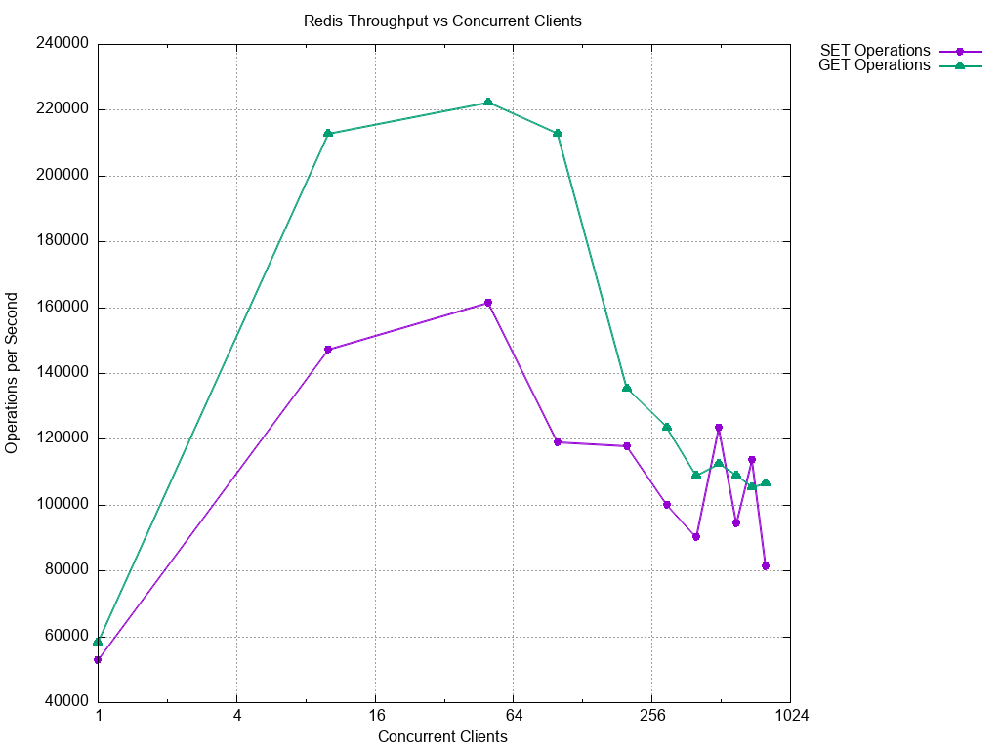
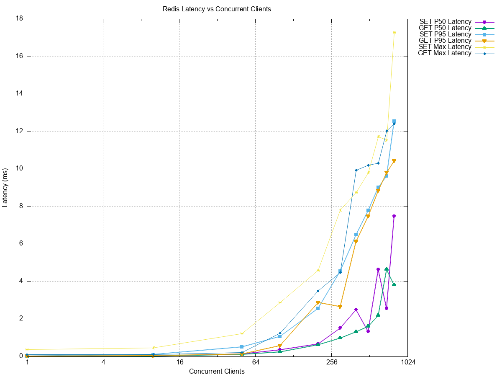
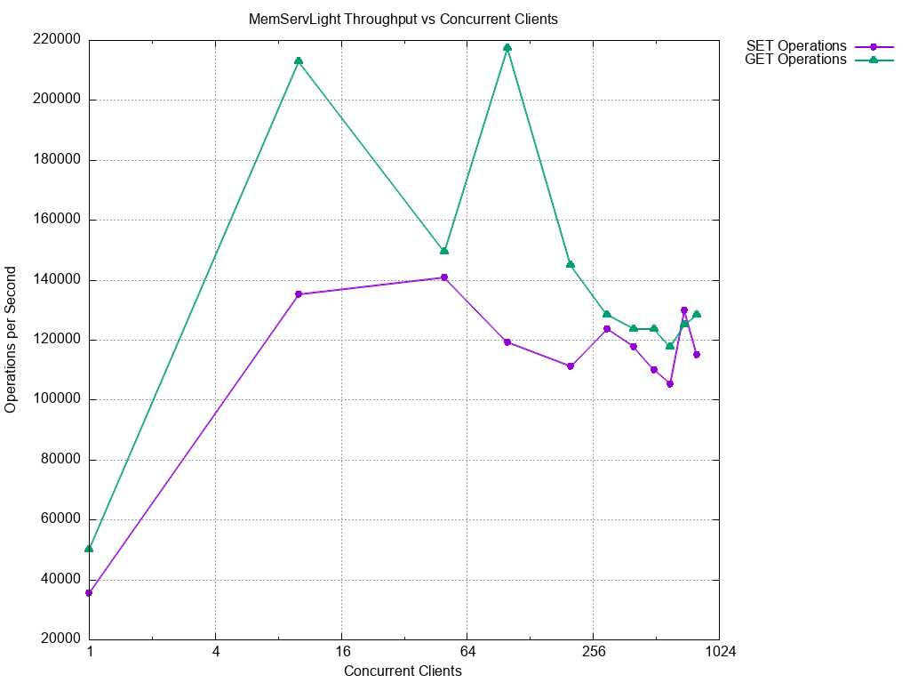
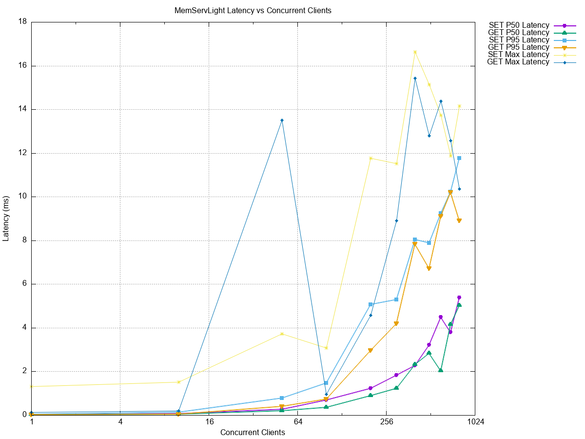

# MemServLight Performance Analysis

I benchmarked MemServLight vs Redis across 1→800 clients, SET/GET, and P50/P95/max latency.

## TL;DR

### Throughput peaks

_Redis:_ SET 161,290 RPS (@50), GET 222,222 RPS (@50)

_MemServLight:_ SET 140,845 RPS (@50), GET 217,391 RPS (@100)

### Latency

Redis has lower P50/P95 at light/moderate load; tails converge at the top end.

At 800 clients, MemServLight has lower P95 on both SET (11.77ms vs 12.56ms) and GET (8.91ms vs 10.44ms).

### Who wins where

_Up to ~100 clients:_ Redis is faster overall and cleaner on tails.

_200–500 clients:_ MemServLight beats Redis on GET throughput (+7–17%).

_600–800 clients:_ MemServLight beats Redis on both SET (+12–41%) and GET (+8–21%) throughput.

## Performance Comparison Charts

## What this says about MemServLight

### Strengths

- Keeps up with Redis at low concurrency, then overtakes at high concurrency (≥200 for GET, ≥600 for SET).

- AOF overhead is modest and throughput shape stays similar.

- Tails converge at high load; at the very top end MemServLight's P95 is lower.

### Areas to improve

- Push down P95 in the 200–500 range (where Redis holds a tail advantage).

- Watch buffer churn and sync work in the hot path (tail outliers at 50–300 clients).

- Keep GET path allocation-light.
